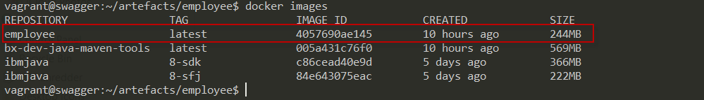

# Deploy Swagger APIs to IBM Cloud Private using IBM Cloud Developer Tools
## A RESTful API approach


**Employee Swagger API**

While working on a project, my client asked if I could quickly demo how to take their Swagger API file and deploy this into [IBM Cloud Private](https://www.ibm.com/developerworks/community/groups/service/html/communityoverview?communityUuid=fe25b4ef-ea6a-4d86-a629-6f87ccf4649e) (an application platform for developing and managing on-premises, containerized applications using Kubernetes as an orchestrator)  also called ICP, with minimal effort and sell the value of ICP and IBM tooling. A nice challenge that makes a whole lot of sense if I could demo this on the fly. A lot rested on my shoulders and had to show that it was possible to whip one out quickly.

I asked if I needed to integrate with their back-end database and the answer was no, luckily as this would have required more thinking to come with such scenario on the fly.
I will walk you through the demo step-by-step; of course, I did make that happen, and now I'm documenting this, I'm in a better position to come up with something more meaningful.

I took a sample Swagger API file from [swagger.io](https://swagger.io/docs/specification/media-types/) and extended with additional POST, PUT, DELETE verbs ; I could explore REST APIs and the desired implementation language. Java was a safe bet for me, although I could have used Python, Node.js or any other programming languages supported by Swagger Code Generator.

I have since turned this to a demo, and now, I have something to show if a similar request comes about. I'd love it if you would follow along and code alongside me.

This blog post is going through the steps required to deploy a Swagger API on IBM Cloud Private; I'll create a Java Spring Microservice using Swagger Code Generator and IBM Cloud Tools and implementing it into a running Kubernetes Cluster to consume RESTful services.

For this, I use a more systematic approach to building this demo and overcomes some of the challenges faced along the way and the workarounds, and all this can be found as a project on my [GitHub](https://github.com/ernesen/swagger-icp.git)

I will create a RESTful API that is used to store employees details, which has CRUD (Create, Read, Update, Delete) functions, allowing us to create new employees, get details of existing employees, update details of existing employees and delete existing employees. All of this by using Java API running on ICP, for what I'm going to show the Swagger Codegen automatically generates a considerable part of the code and saves you tons of time building an integrated app.

Enough with the small talk, let's get down to business, shall we?

## Walkthrough
Here are the steps required for you to reproduce this demo if needed, where an explanation will follow every snippet of code; we need to set up and install the dependencies required for the app to work correctly, no database is needed; perhaps, subject of a future blog.
- Prepare the necessary environment for the demo (step-by-step) with prerequisites
- Build and run the application locally
	- Inspect the generated code
	- Modify the default generated response
	- Run the IBM Tool Dev
	- Deploy and test the code
- Deploy the application to IBM Cloud Private
	- Login into ICP via UI
	- Create namespace in ICP 
	- Authenticate to the ICP Private Docker Registry
	- Configure docker service to use insecure registry
	- Prepare to push the Docker image to the ICP Private Docker Registry 
	- Configure images for helm
	- Install cloudctl
	- Install helm
	- Building and deploying the app in IBM Cloud Private
	- Deploy helm to IBM Cloud Private
	- Deploy and test the code

## Prerequisites
Before I begin, there are some things I need to do: download these tools for the demo the work, so make sure you have these installed before you proceed any further.
- Spring (for Spring REST applications)
- Swagger UI (accessing the API using a browser)
- [Swagger Codegen](https://github.com/swagger-api/swagger-codegen) (generate client code stubs)
- [IBM Cloud Private](https://www.ibm.com/developerworks/community/groups/service/html/communityoverview?communityUuid=fe25b4ef-ea6a-4d86-a629-6f87ccf4649e)
- [IBM Cloud Developer Tools](https://cloud.ibm.com/docs/cli?topic=cloud-cli-ibmcloud-cli#step1-install-idt)

## Installation
Secondly, you are required to have these applications installed, to simplify things. I have created a [git repo](https://github.com/ernesen/swagger-icp.git) with the steps needed so that you can reproduce the demo if you need a local instance running on a vagrant box with IP ```192.168.99.156```; an instance of IBM Cloud Private in a vagrant box with IP ```192.168.27.100``` can also be found here, but you are required at least 16 GB RAM and 250 GB HDD to run it.
- install Java
- install jq
- install Maven
- install IBM Cloud Developer Tools CLI
- install Swagger codegen cli

```sh
sudo apt-get update && sudo apt-get upgrade -y

# jq is a sed-like tool that is specifically built to deal with JSON format.
sudo apt-get install jq -y

# install the latest version of the IBM Cloud CLI tool by issuing the command, make sure you have a minimum version of Docker 1.13.1 installed before installing this tool.
curl -sL http://ibm.biz/idt-installer | bash

# install Java for the Swagger Code generator to work
#sudo apt-get install openjdk-8-jre-headless
sudo apt-get install -y default-jdk

sudo apt-get update -y

# install and configure Maven with the steps below.
sudo apt install maven -y

sudo apt update -y

sudo wget https://www-us.apache.org/dist/maven/maven-3/3.6.0/binaries/apache-maven-3.6.0-bin.tar.gz -P /tmp

sudo tar xf /tmp/apache-maven-*.tar.gz -C /opt

echo "export JAVA_HOME=/usr/lib/jvm/default-java" | sudo tee -a /etc/profile.d/mavenenv.sh
echo "export M2_HOME=/opt/maven" | sudo tee -a /etc/profile.d/mavenenv.sh
echo "export MAVEN_HOME=/opt/maven" | sudo tee -a /etc/profile.d/mavenenv.sh
echo "export PATH=${M2_HOME}/bin:${PATH}" | sudo tee -a /etc/profile.d/mavenenv.sh

sudo chmod +x /etc/profile.d/mavenenv.sh

source /etc/profile.d/mavenenv.sh

# The Swagger Codegen is an open source code-generator to build server stubs and client SDKs directly from a Swagger defined RESTful API.
sudo wget http://central.maven.org/maven2/io/swagger/swagger-codegen-cli/2.4.5/swagger-codegen-cli-2.4.5.jar -O swagger-codegen-cli.jar

sudo mv swagger-codegen-cli.jar ~/artefacts/employee/

cd ~/artefacts/employee/
```

## Build and run the application locally

Before we start all, let's have a quick refresher on REST and its operations and how to use this in the demo; REST stand for **RE**presentational **S**tate **T**ransfer a type of web development architecture that is fully supported by the HTTP standard. REST support these four verbs/operations primarily, Create, Read, Update and Delete, also knows as **CRUD** that maps to your database trigger/operations to manipulate resources, HTTP gives us the following methods with which we must operate:
- **POST**: create resources — **Create**
- **GET**: consult and read resources — **Read**
- **PUT**: edit resources — **Update**
- **DELETE**: eliminate resources — **Delete**


Swagger is a language-agnostic interface to REST APIs with a specification for describing, producing, consuming, testing, and visualizing a RESTful API. It provides several tools for automatically generating documentation based on a given endpoint.

By running the Swagger Codegen on **employee.yaml** we will generate a default server-side implementation of our API microservices using Java and Spring.  All project artifacts and directories are created in the current directory.

Swagger is also known as **OpenAPI**, a blueprint for your APIs, a widely used standard for specifying and documenting REST Services mentioned above.

Let's jump right in to understand it.

The interface is rendered by Swagger Codegen; this model will serve as a blueprint showing what all users in your CRUD will look like. 

The Swagger file employee.yaml is shown below:

```yaml
---
swagger: '2.0' #version of Swagger
info: # High Level information of API
  description: Sample Swagger Demo #Give the description of API
  version: 1.0.0 #API version
  title: Swagger Employee Details Demo # API title
  license: #Swagger license info
    name: Apache 2.0
    url: 'http://www.apache.org/licenses/LICENSE-2.0.html'
host: localhost # Host Name
basePath: /v1 #Basepath when there are multiple versions of API running
tags: # Tag information for each API operation. Multiple tags for multiple API operation
  - name: employee #Tag name
    description: Everything about your Employee #Tag description of API operation
  - name: health
    description: Readiness probe
schemes:
  - http #security schemes
#  - https
consumes:
  - application/json #consumes content type
produces:
  - application/json #produces content type
paths:
  /employees:
    post:
      tags:
      - employee
      summary: Add a new employee
      description: Add a new employees
      operationId: addEmployeeDetails
      parameters:
      - in: body
        name: body
        description: Employees object that needs to be added 
        required: true
        schema:
          $ref: '#/definitions/Employee'
      responses:
        405:
          description: Invalid input
  '/employees/{employeeId}': #Request Mapping path of REST API
    get: #Request method type, GET,POST etc.
      tags: # Refer to created tag above
        - employee
      summary: Find employee by ID #Summary
      description: Returns a single Employee #Description of API operation
      operationId: getEmployeeDetails #Method name
      produces:
        - application/json #Response content type
      parameters:
        - name: employeeId #Input parameter
          in: path #path variable
          description: ID of Employee to return #description of parameter
          required: true #Is mandatory
          type: integer #data type
          format: int64 #data type format, signed 64 bits
      responses: # API response
        '200': #Successful status code
          description: successful operation #Successful status description
          schema:
            $ref: '#/definitions/Employee' #Response object details
        '400': #Unsuccessful response code
          description: Invalid Employee ID supplied #Unsuccessful response description
        '404': #Unsuccessful response code
          description: Employee not found #Unsuccessful response description
    put: #Request method type, GET,POST etc.
      tags: # Refer to created tag above
        - employee
      summary: Update employee by ID #Summary
      description: Returns a single Employee #Description of API operation
      operationId: updateEmployeeDetails #Method name
      produces:
        - application/json #Response content type
      parameters:
        - name: employeeId
          in: path
          description: name that need to be updated
          required: true
          type: string
        - in: body
          name: body
          description: Updated user object
          required: true
          schema:
            $ref: '#/definitions/Employee'
      responses: # API response
        '400': #Unsuccessful response code
          description: Invalid Employee ID #Unsuccessful response description
        '404': #Unsuccessful response code
          description: Employee not found #Unsuccessful response description
    delete: #Request method type, GET,POST etc.
      tags: # Refer to created tag above
        - employee
      summary: Deletes employee by ID #Summary
      description: Returns a single Employee #Description of API operation
      operationId: deleteEmployeeDetails #Method name
      produces:
        - application/json #Response content type
      parameters:
        - name: employeeId #Input parameter
          in: path #path variable
          description: ID of Employee that needs to be updated #description of parameter
          required: true #Is mandatory
          type: integer #data type
          format: int64 #data type format, signed 64 bits
      responses: # API response
        400:
          description: Invalid ID employee
        404:
          description: employee not found
  '/health':
    get:
      tags:
        - health
      operationId: getHealth
      produces:
        - application/json
      responses:
        '200': #Successfule status code
          description: Successful response description
definitions: # Object definition
  Employee: #Employee Object
    type: object
    properties: #Object properties
      id: #Id attribute
        type: integer
        format: int64
      firstName: #Firstname attribute
        type: string
        description: Employee First Name #data type description
      lastName: #Lastname attribute
        type: string #Data type
        description: Employee Last Name #Data type description
    xml:
      name: employee #xml root element when returning xml
```

Let's create a CRUD Spring Boot RESTFul web services with the command below:

``` sh
java -jar swagger-codegen-cli.jar generate \
  -i employee.yaml \
  --api-package com.ibm.example.employee.api \
  --model-package com.ibm.example.employee.model \
  --group-id com.ibm.example \
  --artifact-id spring-swagger-codegen-employee \
  --artifact-version 0.0.1-SNAPSHOT \
  -l spring 
```

After running the above command, we can inspect the directory to see the generated code including src and pom.xml; Maven projects are defined with an XML file named pom.xml, while the src contains the source files, such as Java classes addressed in section "Inspect the generated code"


**List code from Swagger code gen**

### Inspect the generated code

The API’s basePath, '**api/v1**'

Now our employee code is generated from our Swagger specification and will be available as customer-facing documentation when we run our app. Let’s access the REST service through Swagger and REST client to see the default response and change.

 ```java
package com.ibm.example.employee.api;

import com.ibm.example.employee.model.Employee;
import com.fasterxml.jackson.databind.ObjectMapper;
import io.swagger.annotations.*;
import org.slf4j.Logger;
import org.slf4j.LoggerFactory;
import org.springframework.http.HttpStatus;
import org.springframework.http.ResponseEntity;
import org.springframework.stereotype.Controller;
import org.springframework.web.bind.annotation.PathVariable;
import org.springframework.web.bind.annotation.RequestBody;
import org.springframework.web.bind.annotation.RequestHeader;
import org.springframework.web.bind.annotation.RequestParam;
import org.springframework.web.bind.annotation.RequestPart;
import org.springframework.web.multipart.MultipartFile;

import javax.validation.constraints.*;
import javax.validation.Valid;
import javax.servlet.http.HttpServletRequest;
import java.io.IOException;
import java.util.List;
@javax.annotation.Generated(value = "io.swagger.codegen.languages.SpringCodegen", date = "2019-05-07T23:08:43.272Z")

@Controller
public class EmployeesApiController implements EmployeesApi {

    private static final Logger log = LoggerFactory.getLogger(EmployeesApiController.class);

    private final ObjectMapper objectMapper;

    private final HttpServletRequest request;

    @org.springframework.beans.factory.annotation.Autowired
    public EmployeesApiController(ObjectMapper objectMapper, HttpServletRequest request) {
        this.objectMapper = objectMapper;
        this.request = request;
    }

    public ResponseEntity<Void> addEmployeeDetails(@ApiParam(value = "Employees object that needs to be added" ,required=true )  @Valid @RequestBody Employee body) {
        String accept = request.getHeader("Accept");
        return new ResponseEntity<Void>(HttpStatus.NOT_IMPLEMENTED);
    }

    public ResponseEntity<Void> deleteEmployeeDetails(@ApiParam(value = "ID of Employee that needs to be updated",required=true) @PathVariable("employeeId") Long employeeId) {
        String accept = request.getHeader("Accept");
        return new ResponseEntity<Void>(HttpStatus.NOT_IMPLEMENTED);
    }

    public ResponseEntity<Employee> getEmployeeDetails(@ApiParam(value = "ID of Employee to return",required=true) @PathVariable("employeeId") Long employeeId) {
        String accept = request.getHeader("Accept");
        if (accept != null && accept.contains("application/json")) {
            try {
                return new ResponseEntity<Employee>(objectMapper.readValue("{  \"firstName\" : \"firstName\",  \"lastName\" : \"lastName\",  \"id\" : 0}", Employee.class), HttpStatus.NOT_IMPLEMENTED);
            } catch (IOException e) {
                log.error("Couldn't serialize response for content type application/json", e);
                return new ResponseEntity<Employee>(HttpStatus.INTERNAL_SERVER_ERROR);
            }
        }

        return new ResponseEntity<Employee>(HttpStatus.NOT_IMPLEMENTED);
    }

    public ResponseEntity<Void> updateEmployeeDetails(@ApiParam(value = "name that need to be updated",required=true) @PathVariable("employeeId") String employeeId,@ApiParam(value = "Updated user object" ,required=true )  @Valid @RequestBody Employee body) {
        String accept = request.getHeader("Accept");
        return new ResponseEntity<Void>(HttpStatus.NOT_IMPLEMENTED);
    }

}
 ```

**EmployeesApiController.java**

The default code generated by Swagger Codegen returns HTTP Status Code 501 (NOT_IMPLEMENTED) for all the endpoints in the employee.yaml file hence the need to modify the code to change this behavior.

``` sh
cd ~/artefacts/employee/src/main/java/com/ibm/example/employee/api

cp HealthApiController.java HealthApiController.java.old
cp EmployeesApiController.java EmployeesApiController.java.old

sed -i "s/NOT_IMPLEMENTED/OK/" HealthApiController.java
sed -i "s/NOT_IMPLEMENTED/OK/" EmployeesApiController.java
```

A few things required an update, like the EmployeesApiController.java file to get this demo working, by changing the default documentation from NOT_IMPLEMENTED to OK, as shown below:


**Modify EmployeesApiController.java file from default generated response**

``` sh
cd ~/artefacts/employee
```


We can now run this locally; the purpose of running ```ibmcloud dev enable```   it to generate artefacts that we need to Dockerize our application and deploy our application to IBM Cloud private using Helm charts.

``` sh
echo "y" | ibmcloud dev enable
```
These files contain commands to create Docker images for both IBM Cloud and IBM Cloud Private deployment.


**List files after ibmcloud generated files**

There is so much more to IBM Tool Dev, but for now, we are only going to use these two commands ```ibmcloud dev build``` and ```ibmcloud dev run```; these actions will inspect the project to determine the primary language. The identified language will then be used to generate language-specific assets that will be utilized for deployment to IBM Cloud and here it's Java Spring.

``` sh
ibmcloud dev build
ibmcloud dev run
```


**Run the Spring program**

Launching Swagger UI; Swagger UI is the beautiful view we see when we document our api with swagger. The README of the project defines it this way; now navigate to http://192.168.99.156:8080/v1/swagger-ui.html ,  the Swagger 2-generated documentation now looks similar to this:


**Swagger Employee Details Demo UI**


Now navigate to http://192.168.99.156:8080/v1/swagger-ui.html, and you will get the following:


**GET employee 1234 deployed locally**

From command line run ```curl -X GET --header 'Accept: application/json' 'http://192.168.27.100:30527/v1/employees/1234' | jq```

and you will get:

```sh
  % Total    % Received % Xferd  Average Speed   Time    Time     Time  Current
                                 Dload  Upload   Total   Spent    Left  Speed
100   134    0   134    0     0   3828      0 --:--:-- --:--:-- --:--:--  4322
{
  "id": 0,
  "firstName": "firstname",
  "lastName": "NlastName",
}
```

---------------------------------------------------------------------------------------

## Deploy the application to IBM Cloud Private

You can follow the detail instructions for this setup here Install the IBM  [IBM Cloud Developer Tools](curl -sL http://ibm.biz/idt-installer | bash)

Let's continue with what was created from the previous section on the Spring Microservice creation.

Now, we have a few more steps to get this to run on ICP: 


- Creating a Spring Microservice
- Log in and Choose a Cluster
- Configure for Docker Registry Access
- Configure kubectl
- Deploy Helm Chart
- REST-ful Interaction using Swagger Console
- REST-ful Interaction using curl

### Login into ICP via UI
Log in to IBM Cloud Private web console with https://192.168.27.100:8443/, the default credentials are:
login: **admin**
password: **admin**

To get the configuration information, click the user icon in the upper right corner of the screen, and select configure client. The screen displays the configuration information for your cluster that you need to copy and paste into a terminal window where you will be using the kubectl command line interface.


**ICP Configure client details**

### Create namespace in ICP 

Create namespace employee

```kubectl create namespace employee```
To register the namespace employee on ICP, they are a few ways to go about this, here is my favorite:

```sh
kubectl get clusterrolebinding ibm-privileged-psp-users -o yaml > privileged-psp-user.yaml
echo "- apiGroup: rbac.authorization.k8s.io" | sudo tee -a privileged-psp-user.yaml
echo "  kind: Group" | sudo tee -a privileged-psp-user.yaml
echo "  name: system:serviceaccounts:employee" | sudo tee -a privileged-psp-user.yaml
kubectl apply -f privileged-psp-user.yaml
```

### Authenticate to the ICP Private Docker Registry

```sh 
docker images
```



**employee image on Docker**

#### Configure docker service to use insecure registry

Edit /etc/docker/daemon.json with the values below, or run this script that will help with configuring docker service to use insecure registry:

``` sh
echo "{" | sudo tee -a /etc/docker/daemon.json
echo "    \"insecure-registries\" : [ \"mycluster.icp:8500\" ]" | sudo tee -a /etc/docker/daemon.json
echo "}" | sudo tee -a /etc/docker/daemon.json
sudo service docker restart
$ docker login mycluster.icp:8500
```


**Login to docker registry**

### Prepare to push the Docker image to the ICP Private Docker Registry 

Before you can successfully push a Docker image to the ICP Private Docker Registry, there are two things that you must do to prepare:

- ICP must have a namespace that matches the name of the repository within the registry that you are storing the Docker image in.
- The Docker image must be prefixed with the URI for the ICP Private Docker Registry.


``` sh
docker tag employee mycluster.icp:8500/employee/employee:v1.0.0
docker push mycluster.icp:8500/employee/employee:v1.0.0
```

### Configure images for helm

Configure employee in the chart directory to later run on helm

``` sh
sed -i "s|employee|mycluster.icp:8500/employee/employee|" ~/artefacts/employee/chart/employee/values.yaml
sed -i "s|/health|/v1/health|" ~/artefacts/employee/chart/employee/templates/deployment.yaml
```

### Install cloudctl
``` sh
curl -kLo cloudctl-linux-amd64-3.1.2-1203 https://192.168.27.100:8443/api/cli/cloudctl-linux-amd64
sudo mv cloudctl-linux-amd64-3.1.2-1203 /usr/local/bin/cloudctl
sudo chmod +x /usr/local/bin/cloudctl
```
### Install helm
``` sh
curl -kLo helm-linux-amd64-v2.9.1.tar.gz https://192.168.27.100:8443/api/cli/helm-linux-amd64.tar.gz
tar -zxvf helm-linux-amd64-v2.9.1.tar.gz
sudo mv linux-amd64/helm /usr/local/bin/helm
sudo chmod +x /usr/local/bin/helm
```

### Building and deploying the app in IBM Cloud Private

Log in with the credentials shown below and select your namespace where you want to deploy the application, in this case, select 3, which equates to employee the namespace created in section Create namespace in ICP.  


**Deploy employee app on ICP**

### Deploy helm to IBM Cloud Private

``` sh
helm init

helm version --tls

cd ~/artefacts/employee/chart/

helm package employee

# helm del --purge employee --tls
helm install --name employee employee-1.0.0.tgz --namespace employee --tls

kubectl get po,svc -n employee
```


**Issue kubectl command against pods and servers**

## Try API

I used curl to make GET and POST requests from the terminal.
Let’s break down the code snippet above into smaller parts to understand it better. We’ll explore the GET endpoint. The functionality of POST would be very similar. [*](https://towardsdatascience.com/working-with-apis-using-flask-flask-restplus-and-swagger-ui-7cf447deda7f)


**GET employee 1234 deployed on ICP**

## Conclusion

In this blog post, I’ve walked you through the workings of Swagger Code Generator, IBM Cloud Tools and IBM Cloud Private. I took a Swagger file generated microservices with swagger-codegen, built and ran the application locally as the first phase of the demo, and tested it against IBM Cloud Private with the respective REST APIs and CRUD operations.

I hope you found the topic interesting; the complete code can be found in this git repository: https://github.com/ernesen/swagger-icp.git and I hope you consider using IBM Cloud Developer Tools CLI  and IBM Cloud Private for your next project!

Thoughts and ideas are greatly appreciated!

## Attribution
Special thank you to **[Enrique (Ike) Relucio](relucio@ph.ibm.com)** from **IBM Cloud Garage ASEAN**, who was instrumental a getting me on the right path by helping with some docker related topics and suggested some best practice around building Swagger APIs, in addition to testing and reviewing this demo! 

## References
* [Configuring pod security policies](https://cloud.ibm.com/docs/containers?topic=containers-psp#psp)
* [Deploying Helm charts that require elevated privileges in a non-default namespace](https://www.ibm.com/support/knowledgecenter/en/SSBS6K_3.1.2/manage_images/imagepullsecret.html)
* [Creating imagePullSecrets for a specific namespace](https://www.ibm.com/support/knowledgecenter/en/SSBS6K_3.1.2/manage_images/imagepullsecret.html)
* [Adding a pod security policy binding to a namespace](https://www.ibm.com/support/knowledgecenter/SSBS6K_3.1.1/user_management/psp_addbind_ns.html)
* [Let’s understand what an API is](https://medium.com/@basterrika/lets-understand-what-an-api-is-7072eb091e76)
* [What is an API? In English, please.](https://medium.freecodecamp.org/what-is-an-api-in-english-please-b880a3214a82)
* [RESTful API Designing guidelines — The best practices](https://hackernoon.com/restful-api-designing-guidelines-the-best-practices-60e1d954e7c9)

